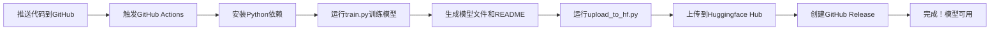

# 练习：使用GitHub CI/CD自动上传ML模型到Huggingface

## 📝 练习目标

创建一个机器学习项目，上传代码到GitHub，并使用GitHub CI/CD自动训练模型并上传到Huggingface。

## 🎯 灵感来源

- https://github.com/reveurmichael/space_mining/tree/main
- https://huggingface.co/LUNDECHEN/space-mining-ppo/tree/main
- https://github.com/reveurmichael/space_mining/blob/main/.github/workflows/train-long-wandb-hf.yml

但我们会做得更简单（不需要复杂的ML模型）

## ✅ 已完成的项目结构

```
.
├── README.md                           # 项目说明文档
├── train.py                            # 模型训练脚本
├── upload_to_hf.py                     # 上传到Huggingface的脚本
├── requirements.txt                    # Python依赖
├── .gitignore                          # Git忽略文件
└── .github/
    └── workflows/
        └── train-and-upload.yml        # GitHub Actions配置
```

## 🚀 部署步骤

### 1. 本地测试（可选）

```bash
# 安装依赖
pip install -r requirements.txt

# 训练模型
python train.py

# 检查生成的模型文件
ls model/
```

### 2. 创建GitHub仓库

1. 在GitHub上创建新仓库（例如：`student-score-predictor`）
2. 初始化本地Git仓库并推送：

```bash
git init
git add .
git commit -m "Initial commit: ML project with CI/CD"
git branch -M main
git remote add origin https://github.com/YOUR_USERNAME/student-score-predictor.git
git push -u origin main
```

### 3. 获取Huggingface Token

1. 访问 https://huggingface.co/settings/tokens
2. 点击 "New token"
3. 名称：`github-actions-upload`
4. 类型：选择 "Write" 权限
5. 复制生成的token

### 4. 在GitHub中配置Secret

1. 进入你的GitHub仓库
2. 点击 `Settings` → `Secrets and variables` → `Actions`
3. 点击 `New repository secret`
4. 名称：`HF_TOKEN`
5. 值：粘贴你的Huggingface token
6. 点击 `Add secret`

### 5. 修改配置文件

编辑 `upload_to_hf.py` 文件的第17行：

```python
repo_id = "YOUR_USERNAME/student-score-predictor"  # 改为你的Huggingface用户名
```

例如：
```python
repo_id = "zhangsan/student-score-predictor"
```

### 6. 触发GitHub Actions

方式1：推送代码
```bash
git add upload_to_hf.py
git commit -m "Update Huggingface username"
git push
```

方式2：手动触发
1. 进入GitHub仓库
2. 点击 `Actions` 标签
3. 选择 "训练模型并上传到Huggingface" 工作流
4. 点击 `Run workflow` → `Run workflow`

### 7. 查看结果

1. 在GitHub Actions页面查看运行日志
2. 成功后，访问 `https://huggingface.co/YOUR_USERNAME/student-score-predictor`
3. 你应该能看到上传的模型文件和README
4. 在GitHub仓库的 "Releases" 页面查看自动创建的Release

## 📊 项目说明

### 模型介绍

- **类型**：线性回归模型（scikit-learn）
- **功能**：根据每周学习小时数预测学生考试成绩
- **输入**：学习小时数（1-25小时）
- **输出**：预测的考试分数

### CI/CD流程



每次推送代码后：
1. 自动训练模型
2. 上传到Huggingface
3. 创建GitHub Release（包含模型文件）
4. Release标签使用时间戳（例如：v20260312-143025）

### 关键文件说明

1. **train.py**
   - 生成模拟数据（学习时间 vs 考试成绩）
   - 训练线性回归模型
   - 保存模型为pickle文件
   - 生成模型卡片（README.md）

2. **upload_to_hf.py**
   - 从环境变量读取HF_TOKEN
   - 创建Huggingface仓库（如果不存在）
   - 上传整个model文件夹

3. **.github/workflows/train-and-upload.yml**
   - 定义CI/CD流程
   - 在推送到main分支时自动触发
   - 支持手动触发（workflow_dispatch）

## 🎓 学到的知识点

- ✅ 使用pickle保存scikit-learn模型
- ✅ GitHub Actions基本配置
- ✅ 使用GitHub Secrets管理敏感信息
- ✅ Huggingface Hub API使用
- ✅ 自动化ML模型部署流程

## 🔧 故障排查

### 问题1：GitHub Actions失败，提示"未找到HF_TOKEN"
**解决**：检查GitHub Secrets是否正确设置，名称必须是 `HF_TOKEN`

### 问题2：上传失败，提示权限错误
**解决**：确保Huggingface token有写入权限

### 问题3：仓库名称错误
**解决**：确保 `upload_to_hf.py` 中的 `repo_id` 格式正确：`用户名/仓库名`

## 📚 扩展练习

1. 添加更多的模型评估指标
2. 使用更复杂的模型（如随机森林）
3. 添加数据可视化
4. 集成Weights & Biases进行实验跟踪
5. 添加模型版本管理

## ✅ 检查清单

- [ ] 本地成功运行 `train.py`
- [ ] GitHub仓库已创建
- [ ] Huggingface token已获取
- [ ] GitHub Secret `HF_TOKEN` 已设置
- [ ] `upload_to_hf.py` 中的用户名已修改
- [ ] `.github/workflows/train-and-upload.yml` 中的Huggingface链接已修改
- [ ] GitHub Actions成功运行
- [ ] 模型已出现在Huggingface Hub上
- [ ] GitHub Release已自动创建

